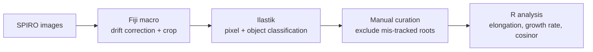

# spiro-root-growth
It is a workflow for measuring primary root growth and its diurnal rhythm from time-lapse images of Arabidopsis seedlings on agar plate

# spiro-root-growth

# Overview

`spiro-root-growth` is a workflow for measuring primary root growth and its diurnal rhythm from time-lapse images of *Arabidopsis* seedlings on agar plates. It takes raw images from the [SPIRO](https://doi.org/10.1101/2021.03.15.435343) imaging robot and produces:

* cumulative root elongation per root and per condition,
* statistical comparison of total elongation between conditions,
* hourly growth rates over the full time course,
* cosinor-based rhythmicity analysis of growth rate (mesor, amplitude, phase) in user-defined time intervals.

The workflow has three stages:



All experiment-specific settings (plates, conditions, excluded roots, calibration, time intervals) are defined in **one config file**, so the same scripts can be used for any number of plates and conditions.

---

# Getting started

### Repository structure

```
spiro-root-growth/
├── README.md
├── config.R                               # all experiment-specific settings
├── fiji/
│   └── SPIRO_Preprocessing_DayNight.ijm   # drift correction and cropping
├── ilastik/
│   └── README.md                          # training recommendations
├── R/
│   ├── TODO_01_import_and_clean.R         # TODO: rename to your script names
│   ├── TODO_02_total_elongation.R
│   └── TODO_03_growth_rhythmicity.R
├── example/                               # config and results of an example experiment
├── data/                                  # your Ilastik exports go here (not tracked by git)
└── results/                               # figures and tables written by the scripts
```

### Requirements

| Software | Purpose | Version |
|---|---|---|
| SPIRO | automated plate imaging | TODO |
| [Fiji / ImageJ](https://fiji.sc) | preprocessing macro | TODO |
| [Ilastik](https://www.ilastik.org) | segmentation and root tip tracking | TODO |
| R | analysis | ≥ 4.6 |
| circacompare | cosinor rhythmicity analysis | TODO |
| tidyverse | data handling and plotting | ≥ 2.0.0 |

```r
install.packages(c("tidyverse", "circacompare"))
```

---

# Step 1: Set up the plates

The analysis works with any number of plates and conditions. For reliable tracking, a few things matter when preparing the plates:

* **Space seedlings 5–10 mm apart** so that roots do not touch or cross during the experiment.
* **Keep a margin of about 1.5 cm from the plate edges** free of seedlings. This avoids edge effects on growth and keeps the plate border out of the crop region later.
* **Avoid labels, marker lines or tape** in the area where roots will grow.
* **Randomise seedlings across plates** and use at least two plates per condition, so that plate effects can be separated from treatment effects.

Note the plate numbers and their conditions. They are entered in `config.R` in Step 5.

---

# Step 2: Image the plates with SPIRO

Place the plates in SPIRO and image them at a fixed interval (hourly is recommended for rhythmicity analysis).

Under light–dark cycles, SPIRO takes day images under white light and night images under green light. Use different camera settings for the two, and keep the focus constant. Settings that worked in the example experiment:

| Setting | Day | Night |
|---|---|---|
| Illumination | white light | green light |
| Shutter speed | 30 | 10 |
| ISO | 50 | 150 |
| Focus | 260 | 260 |

Record the **zeitgeber time (ZT) of the first image** and when lights go on and off. The analysis needs these to place time points in the light–dark cycle.

> TODO: describe the SPIRO output folder structure and file naming.

---

# Step 3: Preprocess the images in Fiji

Run `fiji/SPIRO_Preprocessing_DayNight.ijm` once per plate:

1. Open Fiji, go to **Plugins → Macros → Run…**, and select `SPIRO_Preprocessing_DayNight.ijm`.
2. Select the folder with the SPIRO images of one plate. TODO: confirm the input and output folder prompts.
3. **Drift correction:** the macro asks whether to correct for drift between time points. Use it if the plate moved slightly during the experiment. TODO: describe what the correction does, e.g. registration to the first frame.
4. **Crop:** the macro asks you to draw the crop region. This step determines how well Ilastik can segment and track the roots:
   * **Include only the roots.** Shoots must not be in the crop, because Ilastik would segment leaves and hypocotyls as additional objects.
   * **Keep a distance from the plate corners and edges**, and from any other marks on the plate such as condensation, scratches or labels. These create false objects and tracking errors in Ilastik.
   * **Leave enough space below the root tips** for the whole experiment. Check the last image of the series before confirming the crop, since roots must not grow out of the region.

The output is a cropped, aligned image series per plate.

---

# Step 4: Segment and track the roots with Ilastik

Use Ilastik's **Pixel Classification + Object Classification** workflow for each plate:

1. Load the cropped image series.
2. **Pixel classification:** train at least two classes, root and background. Annotate several time points spread across the experiment and include **both day and night images**, since their brightness differs.
3. **Object classification:** extract one object per root with its bounding box.
4. **Export** the object table for all time points to `data/`, one file per plate.

The root tip position is taken as **`Max_1`**, the maximum y-coordinate of the bounding box, i.e. the lowest point of the root.

A trained project can be reused for later experiments with the same imaging setup. Retrain it if the illumination, camera settings or background change.

> TODO: add the export format and a few example rows of the exported table.

---

# Step 5: Configure the experiment

Open `config.R` and fill in the settings for your experiment. This is the only file you need to edit.

```r
# --- Plates and conditions --------------------------------------------------
plates <- data.frame(
  file      = c("plate1.csv", "plate2.csv", "plate3.csv", "plate4.csv"),
  plate     = c("Plate 1",    "Plate 2",    "Plate 3",    "Plate 4"),
  condition = c("Treatment",  "Treatment",  "Control",    "Control")
)
reference_condition <- "Control"

# --- Roots excluded after visual inspection (see Step 6) --------------------
excluded_roots <- data.frame(
  plate = c("Plate 1", "Plate 2", "Plate 2"),
  label = c(7,          2,         6)
)

# --- Image calibration and cleaning -----------------------------------------
px_per_cm       <- 192   # pixels per cm on the cropped images
max_jump_px     <- 10    # time points with larger hourly movement are removed as artefacts
frame_interval_h <- 1    # hours between images

# --- Light-dark cycle -------------------------------------------------------
first_image_zt <- 2      # ZT of the first image
photoperiod_h  <- 12     # hours of light per cycle
period_h       <- 24     # period used for the cosinor fit

# --- Time windows for rhythmicity analysis (hours from first image) ---------
acclimation_end <- 48    # time points before this are excluded
intervals <- list(
  early = c(48, 94),
  late  = c(94, 165)
)
```

> TODO: adapt the variable names to those used in your scripts.

---

# Step 6: Curate the tracking manually

Inspect the tracking of every plate visually, e.g. by overlaying the Ilastik object labels on the images. Exclude roots that were mis-tracked, for example:

* two roots merged into one object,
* a root that lost or switched its label,
* a root that grew out of the crop region.

Enter the excluded plate and label combinations in `excluded_roots` in `config.R`. Label numbers can change if the images are reprocessed, so repeat this check after any change to Steps 3 or 4.

---

# Step 7: Analyse root growth in R

Run the scripts in order from the repository root:

```r
source("R/TODO_01_import_and_clean.R")
source("R/TODO_02_total_elongation.R")
source("R/TODO_03_growth_rhythmicity.R")
```

### 7.1 Import and clean

This script:
* reads the Ilastik exports listed in `config.R`,
* removes the excluded roots,
* discards time points where a root moves more than `max_jump_px` within one interval (tracking artefacts),
* converts pixels to millimetres using `px_per_cm`.

It writes a cleaned table with one row per root and time point to `results/`.

### 7.2 Total elongation

This script:
* calculates total elongation per root as the final minus the initial tip position,
* compares each condition with `reference_condition` using a **two-sided Wilcoxon rank-sum test**.

It produces three plots:
* mean cumulative growth per condition (± SEM),
* total elongation per root, coloured by plate,
* daily growth per root, stacked by day.

### 7.3 Growth rate and rhythmicity

This script:
* calculates the growth rate per interval (mm per hour) and smooths it with loess,
* excludes the acclimation period (`acclimation_end`),
* fits a cosinor model with `circacompare` at `period_h` for every interval in `intervals`, and compares each condition with the reference,
* averages the growth rate by hour of day to show the mean diurnal profile.

**Output:** a table with rhythmicity p-value, mesor, amplitude and phase per condition and interval, plus plots of growth rate over time and of the averaged diurnal profile, with light and dark phases shaded.

Growth right after moving plates is often erratic, so choose `acclimation_end` by looking at the growth-rate plot before interpreting the cosinor results.

---

# Example

The `example/` folder contains the configuration and main results of the experiment this workflow was developed for: four plates, two conditions, hourly imaging for 165 h under LD 12:12, and 16 vs 15 roots after curation.

It is described in the Master's thesis *"TOR kinase shapes the timing of rhythmic outputs in Arabidopsis roots"* (Valentin Rebernig, Centre for Organismal Studies, Heidelberg University, 2026), Sections 2.3 and 3.2. Use it to check that the workflow runs correctly on your system.

> TODO: add the example config and, if possible, the Ilastik exports (small CSV files) so the R part can be run without images.

---

## Tips and common problems

* **Most tracking errors come from the crop.** Shoots, plate edges or marks inside the crop region create extra objects.
* **Day and night images look different.** Train Ilastik on both, otherwise tracking fails at every light transition.
* **Roots touching or crossing** get merged into one object. Spacing seedlings well in Step 1 prevents this.
* **Rhythmicity needs enough cycles.** An interval should cover at least two full periods for a stable cosinor fit.

## Citation

If you use this workflow, please cite the tools it builds on:

* Ohlsson, J.A. et al. (2021) SPIRO – the automated Petri plate imaging platform designed by biologists, for biologists. *bioRxiv*. https://doi.org/10.1101/2021.03.15.435343
* Berg, S. et al. (2019) ilastik: interactive machine learning for (bio)image analysis. *Nature Methods* 16, 1226–1232. https://doi.org/10.1038/s41592-019-0582-9
* Parsons, R. et al. (2020) CircaCompare: a method to estimate and statistically support differences in mesor, amplitude and phase, between circadian rhythms. *Bioinformatics* 36, 1208–1212. https://doi.org/10.1093/bioinformatics/btz730

## License

TODO (e.g. MIT)
